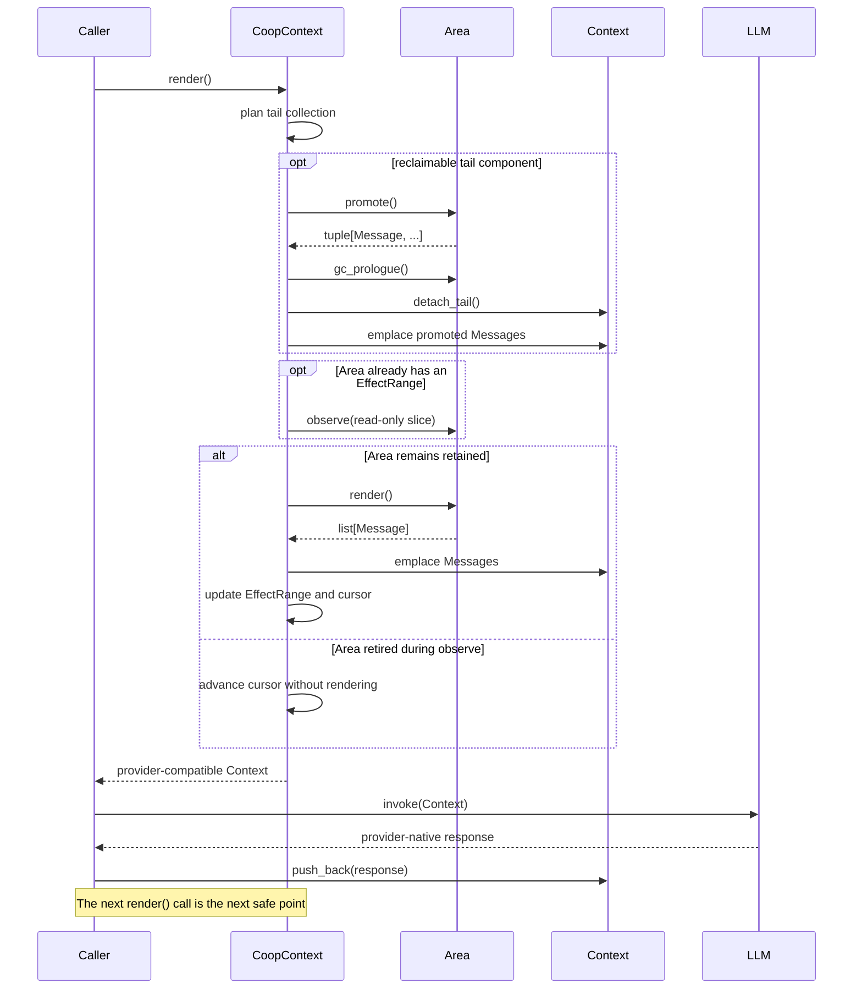

# Declaring a Context Area

A Context Area is a caller-defined object that contributes generic `Message` objects to a `CoopContext`. It also exposes its scheduling and lifetime state so that `CoopContext` can decide when to render it and when its affected Context tail may be reclaimed.

`ContextAreaImplementation` is a structural `Protocol`. An Area does not inherit from a Hydrangea base class and does not use a registration decorator. Any object that satisfies the contract can be registered.

## Minimal implementation

The following Area publishes one authoritative message, retires immediately, and leaves no promoted content behind:

```python
from collections.abc import Sequence

from hydrangea.context import NativeContent
from hydrangea.context.area import (
    AreaFlowState,
    AreaLifeState,
    ContextAreaImplementation,
)
from hydrangea.message import Message, Role


class OneShotNoticeArea:
    _life_state: AreaLifeState
    _flow_state: AreaFlowState
    _content: str
    _rendered: bool

    def __init__(self, content: str) -> None:
        self._life_state = AreaLifeState.retain
        self._flow_state = AreaFlowState.yielded
        self._content = content
        self._rendered = False

    @property
    def life_state(self) -> AreaLifeState:
        return self._life_state

    @property
    def flow_state(self) -> AreaFlowState:
        return self._flow_state

    def observe(
        self,
        context: Sequence[NativeContent],
    ) -> None:
        _ = context

    def render(self) -> list[Message]:
        if self._rendered:
            raise RuntimeError(
                "OneShotNoticeArea rendered more than once."
            )

        self._rendered = True
        self._life_state = AreaLifeState.retired
        return [
            Message(
                role=Role.user,
                content=self._content,
            )
        ]

    def promote(self) -> tuple[Message, ...]:
        return ()

    def gc_prologue(self) -> None:
        pass


area: ContextAreaImplementation = OneShotNoticeArea(
    "Use the repository state as the authoritative source."
)
```

The explicit `ContextAreaImplementation` annotation is optional at runtime, but it asks a static type checker to verify the complete structural contract at the construction boundary.

Register the Area with a cooperative Context:

```python
from hydrangea.context import Context
from hydrangea.context.coop_context import CoopContext
from hydrangea.gateway import GatewayType


context = Context(GatewayType.gemini)
coop_context = CoopContext(context)
coop_context.register(area)

model_context = coop_context.render()
```

`render()` prepares and returns the provider-compatible `Context`; it does not invoke the model itself.

## Contract

| Member | Called or read by `CoopContext` | Responsibility |
| --- | --- | --- |
| `life_state` | During collection and before rendering | Exposes whether the Area remains active or has retired. |
| `flow_state` | After every successful `render()` | Chooses whether this Area keeps the cursor or yields to the next Area. |
| `observe(context)` | Immediately before a repeated render | Observes a shallow, read-only snapshot of the Area's current EffectRange. |
| `render()` | When a retained Area reaches the cursor | Returns generic, caller-constructed messages to append to Context. |
| `promote()` | Once the Area is selected for GC | Returns stable messages that must survive reclamation. |
| `gc_prologue()` | Immediately before Context detachment | Releases or records external resources before the Area is removed. |

### `life_state`

`AreaLifeState` controls lifetime:

- `retain` means that the Area may still observe and render.
- `retired` means that the Area will no longer render and is eligible for collection.

The intended transition is monotonic:

```text
retain -> retired -> removed from CoopContext
```

Retirement is not immediate destruction. A retired Area can remain registered while another retained Area has an overlapping EffectRange that prevents tail reclamation.

### `flow_state`

`AreaFlowState` controls scheduling independently from lifetime:

- `exclusive` keeps the cursor on the current Area and returns the Context immediately after its render.
- `yielded` advances the cursor and allows other Areas to participate in the same unfold pass.

An Area that needs several model turns normally remains `exclusive`. Once that operation completes, it can switch to `yielded` and optionally retire.

### `observe(context)`

`observe()` is called only when all of the following are true:

1. The Area is retained.
2. It reaches the current cursor.
3. A previous non-empty `render()` has already created an EffectRange.

The supplied `Sequence[NativeContent]` is a shallow snapshot. The sequence cannot be resized through this reference, but its provider-native elements may themselves be mutable. An Area must treat both the sequence and its contents as read-only.

`observe()` may change the Area to `retired`. If it does, `CoopContext` skips that Area's `render()` for the current pass.

### `render()`

`render()` returns `list[Message]`, not provider-native content. Hydrangea converts each message through the active provider implementation and appends it with `Context.emplace_message()`.

- A non-empty result creates or extends the Area's EffectRange.
- An empty result does not create or update an EffectRange.
- The first non-empty render fixes `earliest`.
- Later non-empty renders move `latest` to the last newly appended message.

The EffectRange describes the Area's positional influence, not exclusive ownership of every item inside the interval. Model responses and output from other Areas may appear between its earliest and latest positions.

### `promote()`

`promote()` is called during GC after the Collector has selected a complete reclaimable tail component. It returns a tuple of generic messages that will be appended after that tail has been detached.

Return an empty tuple when nothing should survive:

```python
def promote(self) -> tuple[Message, ...]:
    return ()
```

All promotion results are collected before any `gc_prologue()` call. Changing `life_state` or `flow_state` inside `promote()` is outside the contract and cannot cancel collection.

### `gc_prologue()`

`gc_prologue()` is the final notification before the Context tail is detached and the Area is removed. It is intended for external cleanup or final bookkeeping; persistent Context content must already have been returned by `promote()`.

Changing Area state from this callback has no effect on the active collection plan.

## Execution pipeline



Collection happens at the beginning of a later `CoopContext.render()` call. This creates a safe point between model invocations rather than modifying Context while it is in use.

## EffectRange and collection

`CoopContext` stores each materialized Area as a key in an internal `Area -> EffectRange` mapping. Consequently, an Area instance must be hashable by identity. A normal Python class already satisfies this. If an Area is a dataclass, prefer `@dataclass(eq=False)` unless it deliberately supplies a stable hash implementation.

The Collector starts from the Area whose EffectRange reaches furthest toward the Context tail. It follows overlapping ranges backward. The entire connected component can be reclaimed only when every Area in it is retired. A retained overlapping Area blocks reclamation, even when a nested Area has already retired.

This restriction preserves the append-only Context prefix expected by provider-native reasoning state.

## Important invariants

- Register each Area instance only once.
- Treat `retain -> retired` as irreversible.
- Change scheduling and lifetime state from `observe()` or `render()`, not from GC callbacks.
- Return generic `Message` objects; never construct provider-native Context items inside an Area.
- Do not mutate the `NativeContent` objects received by `observe()`.
- Do not assume that retirement implies immediate collection.
- Ensure every long-lived overlapping Area eventually retires, or it can keep an entire tail component resident.
- Route model responses to an Area explicitly when the Area needs information beyond its currently recorded EffectRange.

`CoopContext.register()` currently does not perform runtime Protocol validation, duplicate detection, or synchronization. Static checking and disciplined construction remain part of the caller contract.

## Common Area shapes

### One-shot authority

Render one message, switch to `retired`, return `()` from `promote()`, and allow the message to disappear after one model turn.

### Multi-turn skill

Remain `exclusive` while the skill controls the interaction. Render guidance, accept model or tool results through an explicit application-level interface, then switch to `yielded` and retire when complete.

### Compaction or summary

Remain active while observing a growing EffectRange. Once a threshold is reached, retire and return a stable summary from `promote()`. The Collector removes the old tail and appends that summary as the surviving Context message.

Executable examples are available in [`test_area_patterns.py`](https://github.com/OvenFoSten/Hydrangea/blob/main/tests/context/test_area_patterns.py) and [`test_coop_context_workflow.py`](https://github.com/OvenFoSten/Hydrangea/blob/main/tests/context/test_coop_context_workflow.py).
