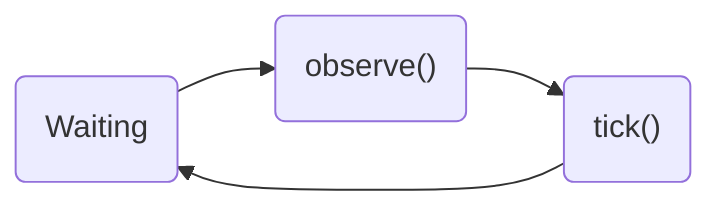
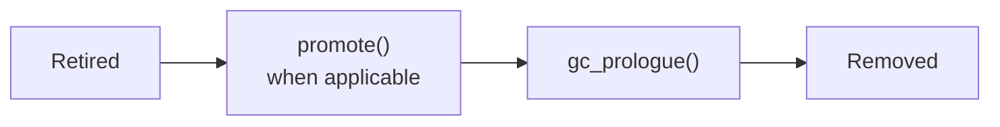

# Lifecycle

## Retained Area

A retained Area follows a simple work cycle:

### `observe(context)`

Receive the latest provider-native Context view. The base implementation stores it in `self._observe_snapshot`. Observed content must be treated as read-only.

### `tick()`

Advance the Area by one step. State and invocation-timing changes happen inside `tick()`, which returns either `None` or a non-empty `list[Message]`.

P.S. `Message` is Hydrangea's non-provider-native message type.

## Retired Area

Once retired, the Area leaves the work cycle and moves toward removal:

### `promote()`

Return generic messages that should outlive the Area. The default implementation returns an empty tuple.

If an Area retires before its first `tick()`, `promote()` is not called; it proceeds directly to `gc_prologue()`.

### `gc_prologue()`

Use this hook to release important resources owned by the Area. It is guaranteed to run before Area GC. The default implementation does nothing.

## Lifecycle state

| `AreaLifeState` | Meaning |
| --- | --- |
| `retain` | Continue the work cycle. |
| `retired` | Stop observing and ticking; wait for finalization. |

The transition is one-way: `retain -> retired -> removed`.

Subclasses of `Area` begin in `retain` and call `self._retire()` when finished.
