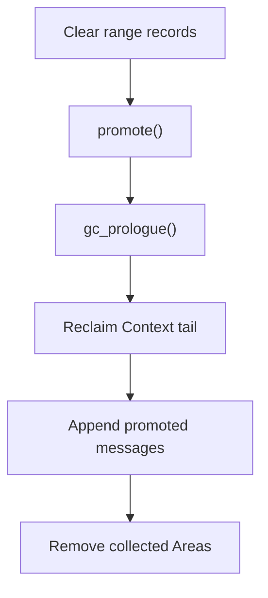

# GC

GC applies the plan produced by Collect to reclaim Context and finalize the selected Areas.

## Clear range records

Remove the selected Areas' `EffectRange` and `ObserveRange` records.

## `promote()`

Gather the Area's messages to preserve. Areas that retire before their first `tick()` skip `promote()`.

## `gc_prologue()`

Release that Area's resources. Each collected Area is guaranteed exactly one call. These two callbacks run in sequence for each Area.

## Reclaim Context tail

If the plan includes a reclaimable tail, detach it from Context and append its contents to `CoopContext.garbage`.

## Append promoted messages

Append the gathered messages to the remaining Context.

## Remove collected Areas

Remove the selected Areas from their lanes, then remove any empty lanes.
