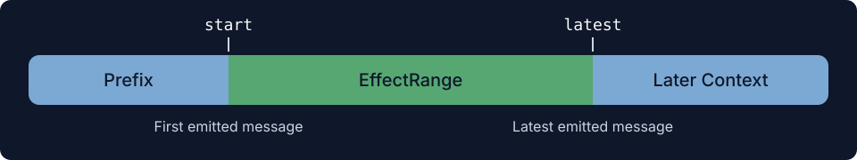
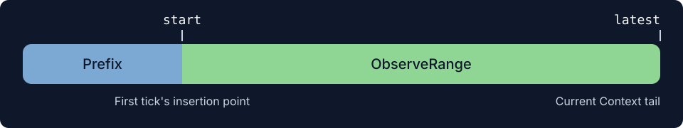

# EffectRange & ObserveRange

## EffectRange

Collect uses `EffectRange` alongside an Area's `life_state` to determine when the Area and its Context effects can be reclaimed.

`EffectRange` tracks the span between an Area's first and most recent messages in Context. Tracking begins when `tick()` first emits a non-empty list of messages. The first message establishes `start`; subsequent emissions advance `latest` to the last newly emitted message.

An Area's messages become part of the prefix for later Context and can influence the content that follows. This influence can extend beyond the recorded `latest`, which advances only when the Area itself emits more messages.

## ObserveRange

`ObserveRange` determines which portion of Context an Area can observe through `observe()`.

Tracking begins after the first `tick()`, even when it returns `None`. `start` is fixed at that tick's insertion position; `latest` is updated to the current Context tail before each later observation.

The observed slice can include the Area's own messages, other Areas' output, and model responses. This lets an Area follow subsequent Context even when its own `tick()` emits nothing.
