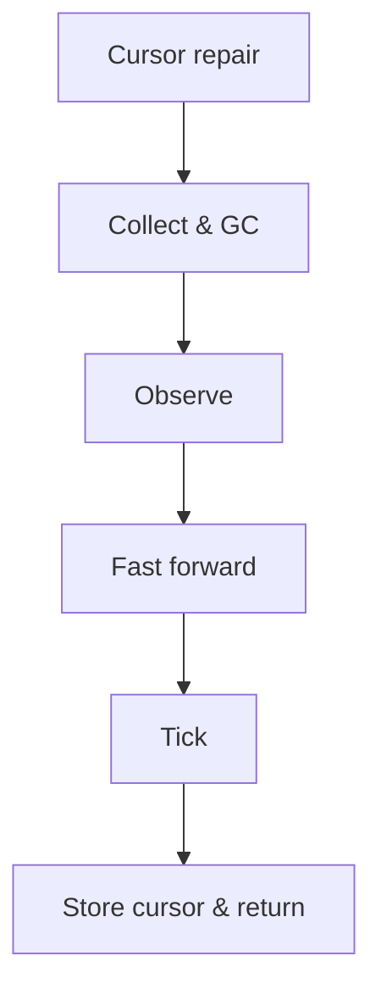

# `unfold()`

`unfold()` advances the `AreaLayout` and returns the updated underlying `Context`. It reclaims eligible Areas, refreshes observations, and ticks the selected Areas to append their messages.

P.S. The name `unfold` reflects expanding the layout expression into concrete Context content.

## Cursor repair

The cursor identifies the lane where scheduling resumes. Cursor repair finds a runnable lane before collection, preserving the current lane if it already contains a retained Area.

## Collect & GC

Collect selects the Areas eligible for reclamation. GC applies that plan before any Area is observed or ticked.

## Observe

Every retained Area with an existing `ObserveRange` receives its current Context slice through `observe()`, whether or not it will tick in this call. The range's `latest` is refreshed to the current Context tail before observation.

## Fast forward

Fast forward scans from the current lane and selects retained Areas up to and including the first `immediate` Area, or completes one full cycle if all are `deferrable`. The batch is selected before any `tick()` runs.

## Tick

The selected Areas run `tick()` in order. Their range records are updated as needed, and emitted messages are appended to Context.

## Store cursor & return

The cursor chosen during candidate selection is saved for the next call. The same underlying `Context` instance is returned.
