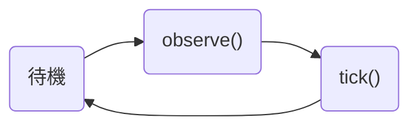
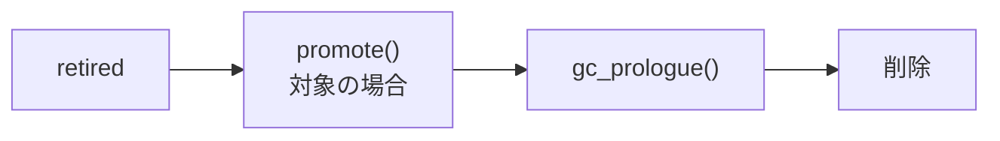

# ライフサイクル

## retain 状態の Area

retain 状態の Area は、次の単純な作業サイクルに従います。

### `observe(context)`

最新のプロバイダー固有の Context ビューを受け取ります。基底実装は、その内容を `self._observe_snapshot` に保存します。観察した内容は読み取り専用として扱う必要があります。

### `tick()`

Area を 1 ステップ進めます。状態と invocation timing の変更は `tick()` の内部で行い、`None` または空でない `list[Message]` を返します。

P.S. `Message` は Hydrangea が定義する、プロバイダー固有ではないメッセージ型です。

## retired 状態の Area

retire した Area は作業サイクルを離れ、削除へ進みます。

### `promote()`

Area より長く保持すべき汎用メッセージを返します。デフォルト実装は空の tuple を返します。

Area が最初の `tick()` より前に retire した場合、`promote()` は呼ばれず、直接 `gc_prologue()` へ進みます。

### `gc_prologue()`

Area が所有する重要なリソースを解放するためのフックです。Area の GC より前に必ず呼び出されます。デフォルト実装は何もしません。

## ライフサイクル状態

| `AreaLifeState` | 意味 |
| --- | --- |
| `retain` | 作業サイクルを継続します。 |
| `retired` | observe と tick を停止し、終了処理を待ちます。 |

遷移は一方向です：`retain -> retired -> removed`。

`Area` のサブクラスは `retain` から始まり、完了時に `self._retire()` を呼び出します。
