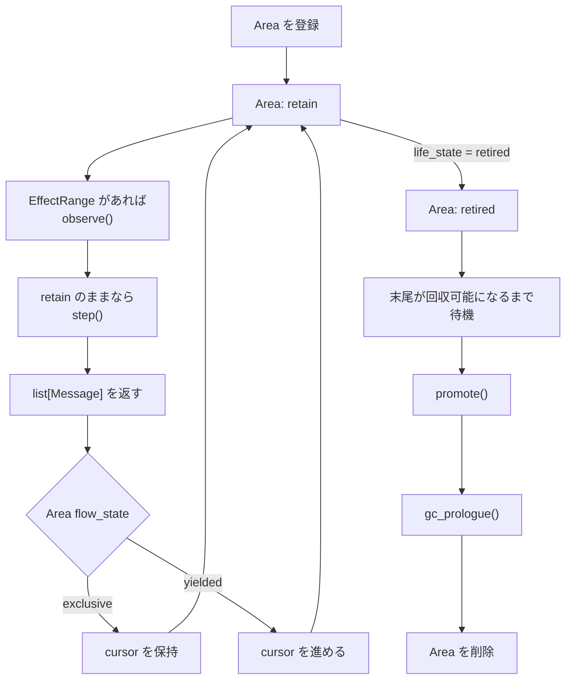

# Context Area の宣言

<p><a href="">English</a> · <strong>日本語</strong></p>

Context Area は、汎用的な `Message` オブジェクトを `CoopContext` に提供する、呼び出し側で定義されたオブジェクトです。また、スケジューリング状態とライフサイクル状態を公開することで、`CoopContext` が Area の次の step をいつ実行し、Area の影響下にある Context の末尾をいつ回収できるか判断できるようにします。

`ContextAreaImplementation` は、構造的部分型に基づく `Protocol` です。Area は Hydrangea の基底クラスを継承する必要がなく、登録用デコレーターも使用しません。契約を満たすすべてのオブジェクトを登録できます。

## 最小実装

次の Area は、信頼すべき情報源となるメッセージを一度だけ公開し、直後に retire し、昇格するメッセージを残しません。

```python
from collections.abc import Sequence

from hydrangea.context import NativeContent
from hydrangea.context.area import (
    AreaFlowState,
    AreaLifeState,
    ContextAreaImplementation,
)
from hydrangea.message import Message, Role


class OneShotNoticeArea:
    _life_state: AreaLifeState
    _flow_state: AreaFlowState

    _content: str
    _stepped: bool

    def __init__(self, content: str) -> None:
        self._life_state = AreaLifeState.retain
        self._flow_state = AreaFlowState.yielded
        self._content = content
        self._stepped = False

    @property
    def life_state(self) -> AreaLifeState:
        return self._life_state

    @property
    def flow_state(self) -> AreaFlowState:
        return self._flow_state

    def observe(
        self,
        context: Sequence[NativeContent],
    ) -> None:
        _ = context

    def step(self) -> list[Message]:
        if self._stepped:
            raise RuntimeError(
                "OneShotNoticeArea stepped more than once."
            )

        self._stepped = True
        self._life_state = AreaLifeState.retired
        return [
            Message(
                role=Role.user,
                content=self._content,
            )
        ]

    def promote(self) -> tuple[Message, ...]:
        return ()

    def gc_prologue(self) -> None:
        pass


area: ContextAreaImplementation = OneShotNoticeArea(
    "Use the repository state as the authoritative source."
)
```

明示的な `ContextAreaImplementation` 型注釈は実行時には任意ですが、構築境界で完全な構造的契約を検証するよう、静的型チェッカーに要求できます。

Area を協調 Context (`CoopContext`) に登録します。

```python
from hydrangea.context import Context
from hydrangea.context.coop_context import CoopContext
from hydrangea.gateway import GatewayType


context = Context(GatewayType.gemini)
coop_context = CoopContext(context)
coop_context.register(area)

model_context = coop_context.advance()
```

`advance()` はプロバイダー互換の `Context` を準備して返します。モデル自体を呼び出すことはありません。

## 契約

| Member | `CoopContext` が参照または呼び出すタイミング | 責務 |
| --- | --- | --- |
| `life_state` | 回収判定時および step 前 | Area が引き続き有効なのか、retire 済みなのかを公開します。 |
| `flow_state` | `step()` が正常に完了した直後 | Area が cursor を保持するか、次の Area に譲るかを選択します。 |
| `observe(context)` | 2 回目以降の step の直前 | Area の現在の EffectRange に対する、浅い読み取り専用スナップショットを受け取ります。 |
| `step()` | retain 状態の Area が cursor に到達したとき | Area を一度進め、呼び出し側で構築した汎用メッセージを返します。 |
| `promote()` | Area が GC 対象に選ばれたとき | 回収後も保持すべき安定したメッセージを返します。 |
| `gc_prologue()` | Context の切り離し直前 | Area が削除される前に、外部リソースを解放または記録します。 |

### `life_state`

`AreaLifeState` はライフサイクルを制御します。

- `retain` は、Area が引き続き observe および step される可能性があることを意味します。
- `retired` は、Area がこれ以上 step されず、回収可能になったことを意味します。

想定される遷移は単調です。

```text
retain -> retired -> CoopContext から削除
```

retire は即時破棄を意味しません。別の retain 状態の Area が重複する EffectRange を持ち、末尾の回収を妨げている場合、retire 済みの Area は登録されたまま残ります。

### `flow_state`

`AreaFlowState` は、ライフサイクルとは独立してスケジューリングを制御します。

- `exclusive` は現在の Area に cursor を保持し、step 後ただちに Context を返します。
- `yielded` は cursor を進め、同じ unfold パスに他の Area が参加できるようにします。

複数のモデルターンを必要とする Area は、通常 `exclusive` のまま動作します。処理が完了したら `yielded` に切り替え、必要に応じて retire できます。

### `observe(context)`

`observe()` は、次の条件をすべて満たす場合にのみ呼び出されます。

1. Area が retain 状態である。
2. Area が現在の cursor に到達している。
3. 以前の空でない `step()` によって、すでに EffectRange が作成されている。

渡される `Sequence[NativeContent]` は浅いスナップショットです。この参照を通して sequence の長さを変更することはできませんが、プロバイダー固有の各要素自体は変更可能である場合があります。Area は sequence とその内容の両方を読み取り専用として扱う必要があります。

`observe()` は Area を `retired` に変更できます。その場合、`CoopContext` は現在のパスにおけるその Area の `step()` をスキップします。

### `step()`

`step()` は Area を一度進め、プロバイダー固有のコンテンツではなく `list[Message]` を返します。Hydrangea は有効なプロバイダー実装を通して各メッセージを変換し、`Context.emplace_message()` で追加します。

- 空でない結果は、Area の EffectRange を作成または拡張します。
- 空の結果は、EffectRange を作成も更新もしません。
- 最初の空でない step によって `earliest` が確定します。
- その後の空でない step は、新しく追加された最後のメッセージまで `latest` を移動します。

EffectRange は Area の位置的な影響範囲を表し、区間内のすべての要素に対する排他的な所有権を表すものではありません。モデルのレスポンスや他の Area の出力が、`earliest` と `latest` の間に含まれる場合があります。

### `promote()`

`promote()` は、Collector が完全に回収可能な末尾の連結成分を選択した後、GC 中に呼び出されます。回収対象の末尾が切り離された後に追加すべき、汎用メッセージの tuple を返します。

何も残す必要がない場合は、空の tuple を返します。

```python
def promote(self) -> tuple[Message, ...]:
    return ()
```

すべての昇格結果は、いずれかの `gc_prologue()` が呼び出される前に収集されます。`promote()` 内で `life_state` または `flow_state` を変更することは契約外であり、進行中の回収を取り消すことはできません。

### `gc_prologue()`

`gc_prologue()` は、Context の末尾が切り離され、Area が削除される直前の最終通知です。外部リソースの解放や最後の状態記録に使用します。永続化する Context の内容は、すでに `promote()` から返されている必要があります。

このコールバックから Area の状態を変更しても、現在の回収計画には影響しません。

## Area のライフサイクル



回収は、その後の `CoopContext.advance()` 呼び出しの先頭で行われます。これにより、Context の使用中に変更するのではなく、モデル呼び出し間にセーフポイントが形成されます。

## EffectRange と回収

`CoopContext` は Context へ出力済みの各 Area を、内部の `Area -> EffectRange` マッピングのキーとして保存します。そのため、Area インスタンスはオブジェクト同一性に基づいてハッシュ可能でなければなりません。通常の Python クラスはすでにこの条件を満たします。Area を dataclass として実装する場合、安定したハッシュを意図的に提供しない限り、`@dataclass(eq=False)` を推奨します。

Collector は、EffectRange が Context の末尾方向へ最も遠く到達している Area から開始し、重複する区間を後方へたどります。連結成分全体は、その中のすべての Area が retire している場合にのみ回収できます。内側の Area がすでに retire していても、重複する retain 状態の Area が存在すると回収は阻止されます。

この制約により、プロバイダー固有の reasoning state が前提とする append-only な Context prefix が維持されます。

## 重要な不変条件

- 同じ Area インスタンスを複数回登録しないでください。
- `retain -> retired` を不可逆な遷移として扱ってください。
- スケジューリング状態とライフサイクル状態は、GC コールバックではなく `observe()` または `step()` から変更してください。
- 汎用的な `Message` を返してください。Area 内でプロバイダー固有の Context 要素を構築しないでください。
- `observe()` から受け取った `NativeContent` オブジェクトを変更しないでください。
- retire が即時回収を意味すると仮定しないでください。
- 長寿命で他と重複する Area は最終的に必ず retire させてください。そうしない場合、末尾の連結成分全体が常駐したままになる可能性があります。
- Area が現在記録している EffectRange を超える情報を必要とする場合、モデルのレスポンスを明示的に Area へ受け渡してください。

`CoopContext.register()` はハッシュ可能性を検証し、同一 Area インスタンスの重複登録を拒否します。実行時の Protocol 検証や同期処理は行いません。
