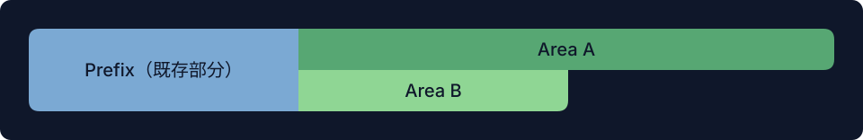

# Collect

Collect は、どの retired Area を GC に進められるか判断します。Context を変更したり Area を削除したりせず、回収計画を作成します。

Collect は各 Area の `EffectRange` を追跡し、右から左への区間走査（right-to-left interval sweep）を行います。重なり合う区間は 1 つの連結成分になります。Context の末尾から見て、その成分のすべての Area が retired の場合にのみ回収できます。

A と B の EffectRange は、prefix の後で重なっています。

- B が retired、A が retain の場合：どちらも回収できません。
- A と B がともに retired の場合：prefix を残し、両方をまとめて回収できます。

## Observation barrier

`ObserveRange` を持ち、`EffectRange` を持たない retain 状態の Area は、observation barrier になります。回収対象の末尾を切り離せるのは、その開始位置が該当するすべての Area の観察開始位置より後にある場合だけです。これにより、観察の境界が有効なまま保たれます。
