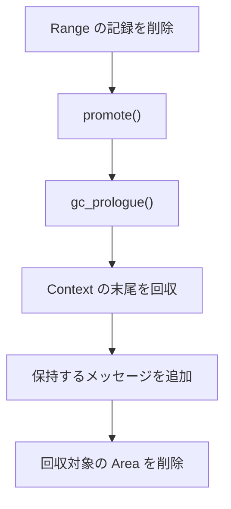

# GC

GC は Collect が作成した計画を適用し、Context を回収して対象の Area の終了処理を行います。

## Range の記録を削除

回収対象の Area の `EffectRange` と `ObserveRange` の記録を削除します。

## `promote()`

Area が保持したいメッセージを集めます。最初の `tick()` より前に retire した Area では、`promote()` を呼び出しません。

## `gc_prologue()`

その Area のリソースを解放します。回収される各 Area に対して、必ず 1 回呼び出されます。この 2 つのコールバックは、Area ごとに順番に実行されます。

## Context の末尾を回収

計画に回収可能な末尾が含まれる場合は、Context から切り離し、その内容を `CoopContext.garbage` に追加します。

## 保持するメッセージを追加

集めたメッセージを、残った Context に追加します。

## 回収対象の Area を削除

回収対象の Area をそれぞれの lane から削除し、その後、空になった lane を削除します。
