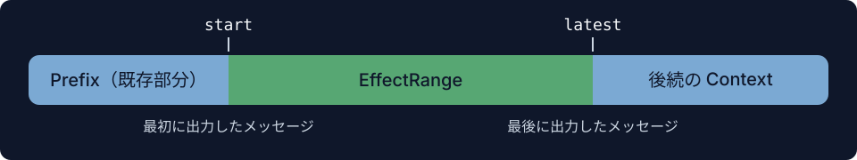
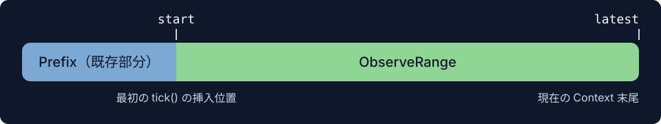

# EffectRange & ObserveRange

## EffectRange

Collect は `EffectRange` と Area の `life_state` を使い、Area とその影響下にある Context をいつ回収できるか判断します。

`EffectRange` は、Area が Context に出力した最初のメッセージから、最新のメッセージまでの範囲を追跡します。追跡は `tick()` が初めて空でないメッセージリストを返したときに始まります。最初のメッセージの位置が `start` となり、その後に出力するたびに `latest` が新しく出力した最後のメッセージの位置まで進みます。

Area のメッセージは後続の Context の prefix となり、その後の内容に影響を与える可能性があります。この影響は記録された `latest` より先に及ぶことがありますが、`latest` が進むのは、その Area 自身が新たにメッセージを出力したときだけです。

## ObserveRange

`ObserveRange` は、Area が `observe()` を通じて観察できる Context の範囲を決めます。

追跡は最初の `tick()` の後に始まり、その戻り値が `None` でも開始されます。`start` は最初の tick での挿入位置に固定され、`latest` は以後の各観察の前に、その時点の Context の末尾に更新されます。

観察する範囲には、その Area 自身のメッセージ、他の Area の出力、モデルのレスポンスが含まれます。そのため、自身の `tick()` が何も出力しなくても、後続の Context を観察し続けられます。
