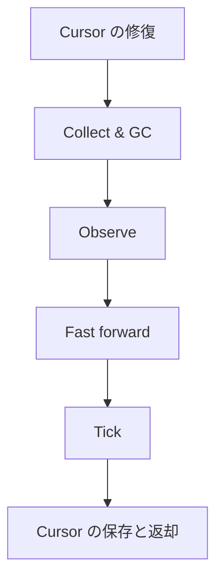

# `unfold()`

`unfold()` は `AreaLayout` を進め、更新した内部の `Context` を返します。回収可能な Area を回収し、観察内容を更新し、選択した Area を tick してメッセージを追加します。

P.S. `unfold` という名前は、layout の記述を具体的な Context の内容へ展開することを表しています。

## Cursor の修復

cursor は、処理を再開する lane を指します。Cursor repair は回収前に実行可能な lane を探し、現在の lane に retain 状態の Area があれば、その lane を維持します。

## Collect & GC

Collect は回収可能な Area を選択します。GC は、Area の observe や tick より前に、その計画を適用します。

## Observe

既存の `ObserveRange` を持つすべての retain 状態の Area は、この呼び出しで tick するかどうかにかかわらず、`observe()` を通じて現在の Context の範囲を受け取ります。観察の前に、範囲の `latest` を現在の Context の末尾に更新します。

## Fast forward

Fast forward は現在の lane から走査し、最初の `immediate` Area まで、その Area を含めて retain 状態の Area を選択します。すべてが `deferrable` の場合は 1 巡します。最初の `tick()` を実行する前に、対象の Area をすべて選択します。

## Tick

選択した Area の `tick()` を順に実行します。必要に応じて範囲の記録を更新し、出力されたメッセージを Context に追加します。

## Cursor の保存と返却

候補の選択時に決めた cursor を、次の呼び出しのために保存します。同じ内部の `Context` インスタンスを返します。
